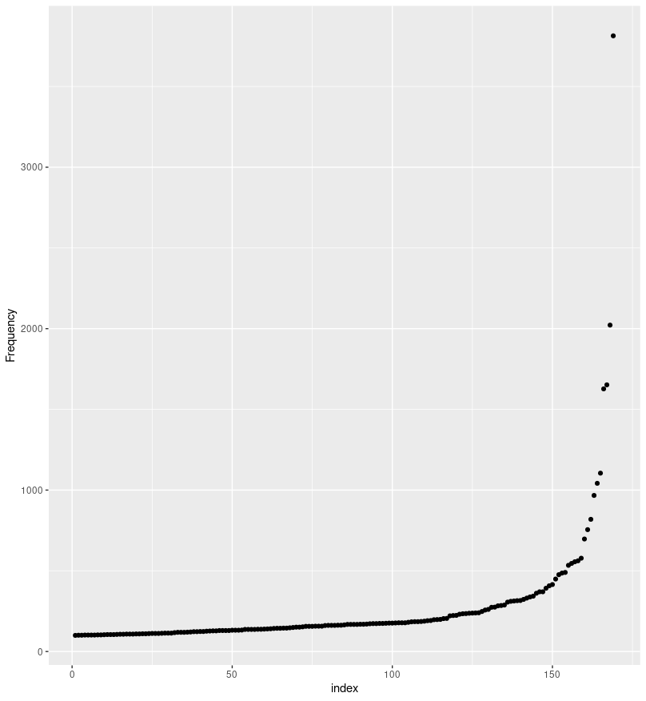
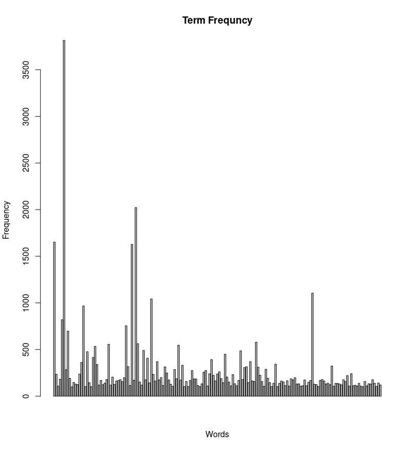
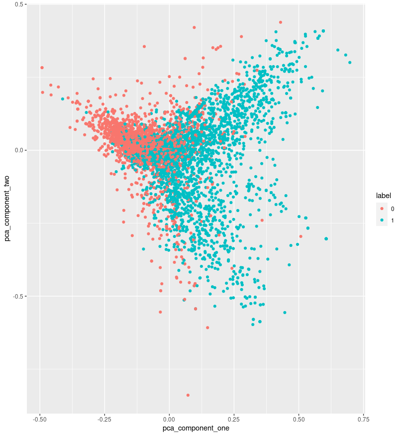
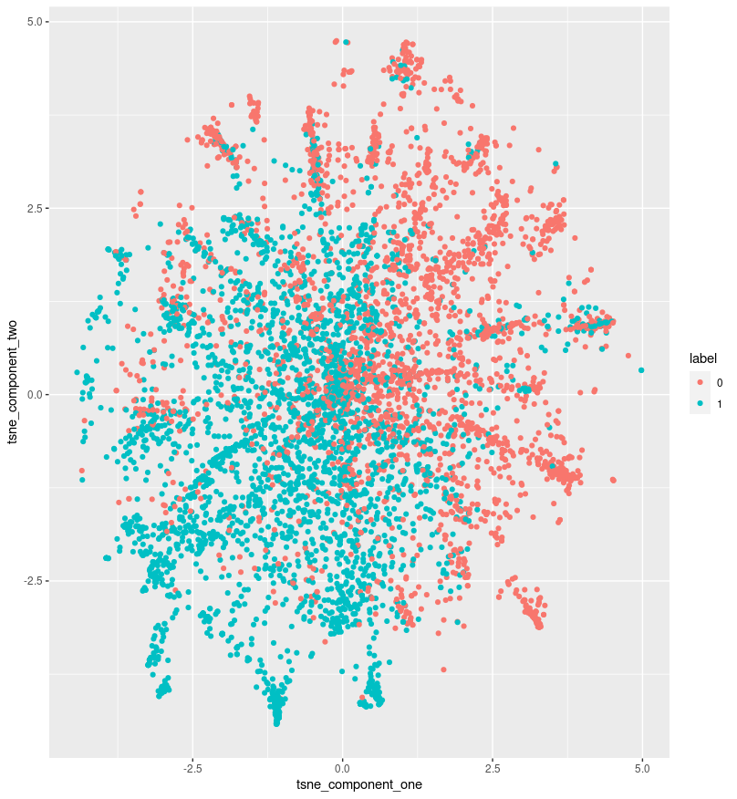
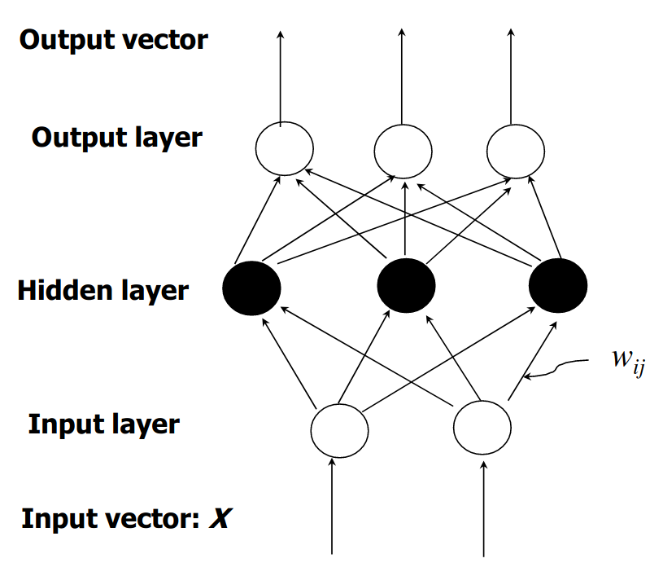
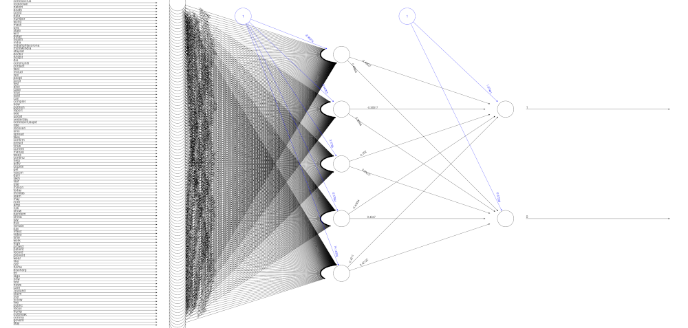
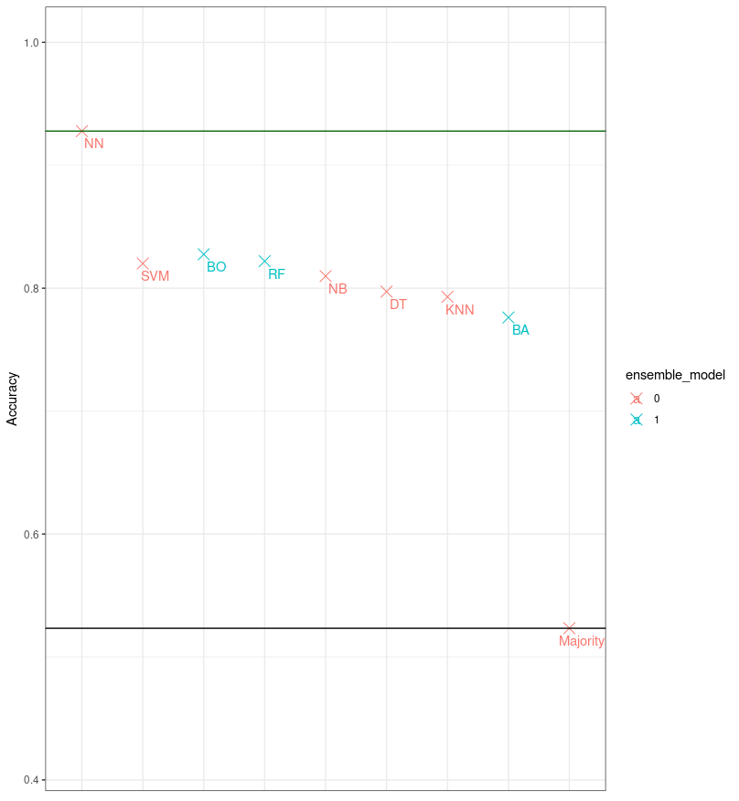
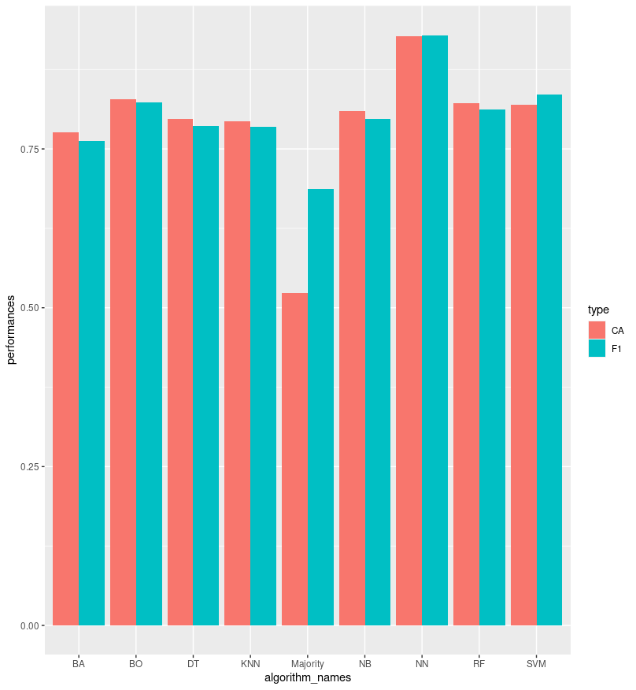
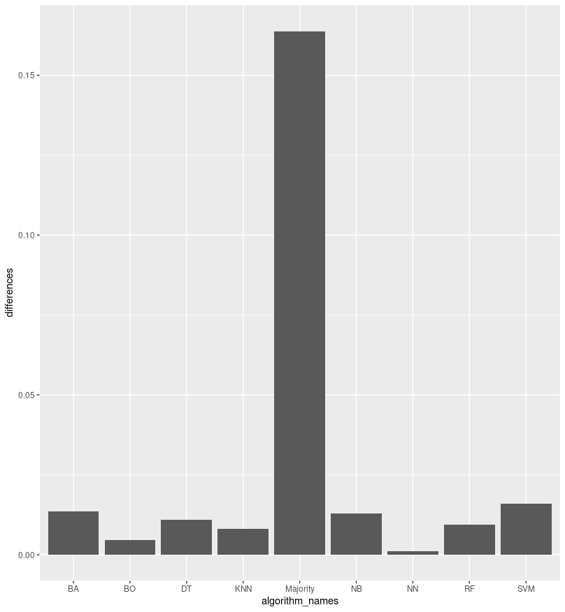

# Fake News Detection

### *Task overview*

*Documents are collections of ordered strings – string sequences. In the assignment, you shall inspect, transform and learn from this type of input. You are provided a pre-split collection of labeled documents (train.tsv, test.tsv) related to detection of fake news. The task is to:* 

1. *pre-process the documents,* 
2. *do feature construction,*
3. *model of the documents and* 
4. *evaluate.* 

*The documents represent snippets of social media text and are labelled as either fake (**0**) or true (**1**).*

# Preparation

For the program to work properly, we must first download all the libraries we need (`install.packages()`), and then we must include them in our program (`library()`).

```r
########################### PREPARATION ########################################

install.packages(
  c(
    "tm",
    "SnowballC,",
    "wordcloud",
    "RColorBrewer",
    "ggplot2",
    "CORElearn",
    "Rtsne",
    "class",
    "caret",
    "e1071",
    "parallel",
    "doParallel",
    "CORElearn",
    "ipred",
    "neuralnet",
    "randomForest",
    "adabag"
  )
)
install.packages(
	"openNLPmodels.en", 
	repos="http://datacube.wu.ac.at/", 
	type="source"
)

library(tm)
library(wordcloud)
library(SnowballC)
library(RColorBrewer)
library(ggplot2)
library(Rtsne)
library(class)
library(caret)
library(e1071)
library(parallel)
library(doParallel)
library(CORElearn)
library(ipred)
require(neuralnet)
library(randomForest)
library(adabag)
```

The next thing we need to do is set up work directory (`setwd()`) and read learning (`learn`) and test (`test`) data. The data consists of two attributes, namely a `label` that tells us whether it is fake or true news and social media `text`.

```r
# read data
train <-
  read.table(
    "train_data.tsv",
    sep = "\t",
    header = T,
    col.names = c("label", "text"),
    comment.char = "",
    quote = ""
  )
test <-
  read.table(
    "test_data.tsv",
    sep = "\t",
    header = T,
    col.names = c("label", "text"),
    comment.char = "",
    quote = ""
  )

train$label <- as.factor(train$label)
test$label <- as.factor(test$label)
```

Finally, a rough summary of the learning and test data read is presented below.

```r
summary(train)
summary(test)

################################################################################
```

And the output is:

```r
> summary(train)
 label        text          
 0:3060   Length:6420       
 1:3360   Class :character  
          Mode  :character  

> summary(test)
 label        text          
 0:1020   Length:2140       
 1:1120   Class :character  
          Mode  :character
```

From the above output we can see that the learning set consists of 6420 cases and the test set of 2140 cases. This means that number of all cases is 8560, the learning set represents **75%** of all cases, and the test set **25%**.

# 1. Pre-processing

After reading the data from the files, we need to clean them. Given that this is fairly real data, this means that it contains a lot of noises, which we want to get rid of.

```r
######################## 1: PRE-PROCESSING #####################################

# function that transform string into pattern
sub_space <-
  content_transformer(function(string, pattern)
    gsub(pattern, " ", string))

# function that cleans data of all possible noises
	get_clean_data <- function(data, whole_words = TRUE) {
  corpus <- Corpus(VectorSource(data))
  corpus  <-
    tm_map(corpus , content_transformer(tolower)) # transfrom to lowercase
  corpus  <-
    tm_map(corpus , removeWords, stopwords('english')) # remove stopwords
  corpus  <- tm_map(corpus , removeNumbers) # remove numbers
  corpus  <- tm_map(corpus , removePunctuation) # remove punctuation
  corpus <-
    tm_map(corpus, sub_space, "[^a-zA-Z]") # remove strange symbols
  corpus <-
    tm_map(corpus, sub_space, "http\\S*") # remove links
  corpus <-
    tm_map(corpus, sub_space, "@\\S*") # remove email
  if (whole_words) {
    corpus  <- tm_map(corpus , stemDocument)
  }
  corpus  <- tm_map(corpus , stripWhitespace)
}

corpus_train = get_clean_data(train$text)
corpus_test = get_clean_data(test$text)
```

To clean the data, we will use the `get_clean_data` function, which takes the data and cleans it. The function first converts the entire text to lowercase, then removes all stopwords, numbers and punctuation. For additional data purity, we have added the removal of all non-letter symbols, all links and email addresses. We then keep only the roots of the words from the data, as these are the ones that mean the most to us, and for the end, we remove all additional, unnecessary spaces.

To remove various non-letter symbols, URL links and emails, we have implemented the `sub_space` function, which removes them.

```r
# function that calculates term frequency
get_term_frequency <- function(corpus, frequency = 0) {
  term_document_matrix <- TermDocumentMatrix(corpus)
  term_frequency <- rowSums(as.matrix(term_document_matrix))
  term_frequency <-
    subset(term_frequency, term_frequency >= frequency)
  return(term_frequency)
}

# function that visualizes words order by frequency
word_cloud <- function(corpus,
                       frequency = 0,
                       min_frequency = 100,
                       color = TRUE) {
  term_document_matrix <- TermDocumentMatrix(corpus)
  term_frequency <- get_term_frequency(corpus, frequency)
  word_frequency <-
    sort(rowSums(as.matrix(term_document_matrix)), decreasing = TRUE)
  gray_levels <-
    gray((word_frequency + 10) / (max(word_frequency) + 10))
  wordcloud(
    words = names(word_frequency),
    freq = word_frequency,
    min.freq = min_frequency,
    random.order = FALSE,
    colors = if (color)
      brewer.pal(12, "Paired")
    else
      gray_levels,
  )
}

term_frequency_train <- get_term_frequency(corpus_train, 100)
qplot(seq(length(term_frequency_train)),
      sort(term_frequency_train),
      xlab = "index",
      ylab = "Frequency")
barplot(
  term_frequency_train,
  main = "Term Frequncy",
  horiz = FALSE,
  xlab = "Words",
  ylab = "Frequency",
  axisnames = FALSE
)
word_cloud(corpus_train, 250, 100, TRUE)

################################################################################
```

To work with the number of occurrences of words, we implemented the `get_term_frequency` function, which returns a list of words and the number of their occurrences.

For a clearer presentation of word frequency, we have also implemented the `word_cloud` function, which draws a word cloud, where the most common words are written to the largest and are located in the middle of the word cloud. The less words appear in the learning data, the more they are on the edge of the word cloud.

In the picture below we can see a graph of the increasing frequency of words according to their index. The graph is limited to words that appear at least 100 times in the learning set for ease of reference.



Below is another presentation of the frequency of individual words. The graph below is also limited to words that appear at least 100 times in the learning set for ease of reference.



The figures below show perhaps more interesting representations of word frequency in the cloud of word clouds. The only difference is that in the left picture more common words are colored darker gray than less common, and the words in the right picture are arranged in a cluster of 8 different colors, where words colored with warmer colors (e.g. red) are more common than words colored with cooler colors (e.g. blue).


From the image above we can see that some of the most common words are: *covid, coronavirus, case, test, new, report, state, number, death, people, confirm, etc.*

# 2. Feature construction

Now that we have read the data and analyzed the word frequency, we need to convert this data into a format that will match the format of the input to the machine learning algorithms. Let's implement a procedure for building a real-valued matrix (rows = documents, columns = characteristics), which is suitable for learning on machine learning algorithms.

```r
##################### 2: FEATURE CONSTRUCTION ##################################

# construct a document-term matrix for train data
document_term_matrix_train <-
  DocumentTermMatrix(corpus_train, control = list(weighting = weightTfIdf))
# find the most similar documents in the term-document matrix
document_term_matrix_train <-
  removeSparseTerms(document_term_matrix_train, sparse = 0.98)

# construct a document-term matrix for test data
document_term_matrix_test <-
  DocumentTermMatrix(corpus_test,
                     control = list(
                       dictionary = Terms(document_term_matrix_train),
                       weighting = weightTfIdf
                     ))

document_term_matrix_train
document_term_matrix_test

mat_train = as.matrix(document_term_matrix_train)
mat_test = as.matrix(document_term_matrix_test)[, names(as.data.frame(mat_train))]
```

Using the function, we create a document-term matrix over the learning data, in which we then remove the sparsity with a factor of `0.98`. Using a created matrix, we create a document-term matrix over the test data using a similar procedure, taking into account the terms from the learning data. The test data matrix is then further limited to words that appear in the learning set (thus increasing the accuracy of machine learning algorithms for a given case, but in all probability reducing the robustness and scalability of our research).

The final space we will use for learning is a matrix converted into data frame, where rows represent documents and columns represent terms. In next chapter we also joined the label of training and testing set to the data frame as it is convenient for machine learning algorithms, which we use.

At this point, the document term matrices for learn and test data look something like this:

```r
> document_term_matrix_train
<<DocumentTermMatrix (documents: 6420, terms: 110)>>
Non-/sparse entries: 32978/673222
Sparsity           : 95%
Maximal term length: 17
Weighting          : 
	term frequency - inverse document frequency (normalized) (tf-idf)

> document_term_matrix_test
<<DocumentTermMatrix (documents: 2140, terms: 110)>>
Non-/sparse entries: 10863/224537
Sparsity           : 95%
Maximal term length: 17
Weighting          : 
	term frequency - inverse document frequency (normalized) (tf-idf)
```

In order to better understand what kind of data we have to work with (especially the learning set), we will also show the data we have cleaned and converted into the appropriate format. This way, we can more easily assess which machine learning algorithm and its parameters are the most suitable for our problem domain and consequently the result will be the best.

```r
# visualize train data with PCA (Principle Components Analysis)
pca_train <- prcomp(mat_train)
pca_component_one <- as.numeric(pca_train$x[, 1])
pca_component_two <- as.numeric(pca_train$x[, 2])
# visualize the possible separation in 2D orthogonal space
qplot(pca_component_one, pca_component_two,
      color = train$label) + labs(color = 'label')

# visualize train data with t-SNE (t-Distributed Stochastic Neighbor Embedding)
tsne_train <-
  Rtsne(
    mat_train,
    perplexity = 1500,
    theta = 0.5,
    dims = 2,
    check_duplicates = FALSE
  )
tsne_train <- tsne_train$Y
tsne_component_one <- as.numeric(tsne_train[, 1])
tsne_component_two <- as.numeric(tsne_train[, 2])
# visualize the possible separation in 2D orthogonal space
qplot(tsne_component_one, tsne_component_two,
      color = train$label) + labs(color = 'label')

################################################################################
```

The image below shows the data using the Principle Components Analysis (`PCA`) algorithm.



The image below shows the data using the t-Distributed Stochastic Neighbor Embedding (`t-SNE`) algorithm.



# 3. Modeling

Now that we have cleaned the data and converted it into the appropriate format, we can start writing different machine learning algorithms and comparing the results for a given problem domain.

```r
########################### 3: MODELING ########################################

data_train <-
  cbind(as.data.frame(mat_train), train$label)
names(data_train)[ncol(data_train)] <- "label_train"
data_test <- cbind(as.data.frame(mat_test), test$label)
names(data_test)[ncol(data_test)] <- "label_test"
```

Our machine learning models will learn on a learning set (`data_train`) and perform meaningful, mathematical prediction on a test set (`data_test`).

```r
# function that calculates classification accuracy
CA <- function(observed, predicted) {
  table <- table(observed, predicted)
  return(sum(diag(table)) / sum(table))
}
```

Before we begin, it would make sense to write down our function, which will calculate our classification accuracy (`CA`) over the prediction of the algorithm and the actual correct result.

We will first use five different machine learning classifiers and then three different machine learning ensemble methods. Let’s start with machine learning classifiers.

### k-Nearest Neighbour Classification

k-Nearest Neighbor (KNN) is a lazy learning algorithm which stores all instances correspond to training data points in n-dimensional space. When an unknown discrete data is received, it analyzes the closest k number of instances saved (nearest neighbors) and returns the most common class as the prediction and for real-valued data it returns the mean of k nearest neighbors. 

In the distance-weighted nearest neighbor algorithm, it weights the contribution of each of the k neighbors according to their distance using the following query giving greater weight to the closest neighbors.

$$
w \equiv \frac{1}{d(x_q,x_i)^2}
$$

Usually KNN is robust to noisy data since it is averaging the k-nearest neighbors.

```r
# k-Nearest Neighbour Classification
r_train <- which(names(data_train) == "label_train")
r_test <- which(names(data_test) == "label_test")
predicted_knn <-
  knn(data_train[, -r_train], data_test[, -r_test], train$label)
observed_knn <- test$label
# classification accuracy
ca_knn <- CA(observed_knn, predicted_knn)
ca_knn
```

The KNN result for our problem is: `0.7929907`

### Decision Tree

Decision tree builds classification or regression models in the form of a tree structure. It utilizes an if-then rule set which is mutually exclusive and exhaustive for classification. The rules are learned sequentially using the training data one at a time. Each time a rule is learned, the tuples covered by the rules are removed. This process is continued on the training set until meeting a termination condition.

The tree is constructed in a top-down recursive divide-and-conquer manner. All the attributes should be categorical. Otherwise, they should be discretized in advance. Attributes in the top of the tree have more impact towards in the classification and they are identified using the information gain concept.

A decision tree can be easily over-fitted generating too many branches and may reflect anomalies due to noise or outliers. An over-fitted model has a very poor performance on the unseen data even though it gives an impressive performance on training data. This can be avoided by pre-pruning which halts tree construction early or post-pruning which removes branches from the fully grown tree.

```r
# Decision Tree
model_dt <- CoreModel(label_train ~ ., data_train, model = "tree")
predicted_dt <- predict(model_dt, data_test, type = "class")
observed_dt <- test$label
# classification accuracy
ca_dt <- CA(observed_dt, predicted_dt)
ca_dt
```

The decision tree result for our problem is: `0.7971963`

### Naive Bayes

Naive Bayes is a probabilistic classifier inspired by the Bayes theorem under a simple assumption which is the attributes are conditionally independent.

$$
P(X|C_i) = \prod_{k=1}^{n} P(x_k|Ci) = P(x_1|C_i) \times P(x_2|C_i) \times ... \times P(x_n|C_i)
$$

The classification is conducted by deriving the maximum posterior which is the maximal P(Ci|X) with the above assumption applying to Bayes theorem. This assumption greatly reduces the computational cost by only counting the class distribution. Even though the assumption is not valid in most cases since the attributes are dependent, surprisingly Naive Bayes has able to perform impressively.

Naive Bayes is a very simple algorithm to implement and good results have obtained in most cases. It can be easily scalable to larger datasets since it takes linear time, rather than by expensive iterative approximation as used for many other types of classifiers.

Naive Bayes can suffer from a problem called the zero probability problem. When the conditional probability is zero for a particular attribute, it fails to give a valid prediction. This needs to be fixed explicitly using a Laplacian estimator.

```r
# Naive Bayes
model_nb <- CoreModel(label_train ~ ., data_train, model = "bayes")
predicted_nb <- predict(model_nb, data_test, type = "class")
observed_nb <- test$label
# classification accuracy
ca_nb <- CA(observed_nb, predicted_nb)
ca_nb
```

The naive Bayes result for our problem is: `0.8098131`

### Support Vector Machine

Support Vector Machine (SVM) is one of the most popular Supervised Learning algorithms, which is used for Classification as well as Regression problems. However, primarily, it is used for Classification problems in Machine Learning.

The goal of the SVM algorithm is to create the best line or decision boundary that can segregate n-dimensional space into classes so that we can easily put the new data point in the correct category in the future. This best decision boundary is called a hyperplane.

SVM chooses the extreme points/vectors that help in creating the hyperplane. These extreme cases are called as support vectors, and hence algorithm is termed as Support Vector Machine. Consider the below diagram in which there are two different categories that are classified using a decision boundary or hyperplane:


```r
# Support Vector Machine
set.seed(42)
# calculate the number of cores
nuber_of_cores <- detectCores() - 1
# create the cluster for caret to use
cluster <- makePSOCKcluster(nuber_of_cores)
registerDoParallel(cluster)
# svm with a linear kernel
model_svm <-
  train(as.factor(label_train) ~ .,
        data = data_train,
        method = "svmLinear")
predicted_svm <-
  predict(model_svm, data_test, type = "raw")
observed_svm <- test$label
# classification accuracy
ca_svm <- CA(observed_svm, predicted_svm)
ca_svm
stopCluster(cluster)
registerDoSEQ()
```

The SVM result for our problem is: `0.8200935`

### Artificial Neural Networks



Artificial Neural Network is a set of connected input/output units where each connection has a weight associated with it started by psychologists and neurobiologists to develop and test computational analogs of neurons. During the learning phase, the network learns by adjusting the weights so as to be able to predict the correct class label of the input tuples.

There are many network architectures available now like Feed-forward, Convolutional, Recurrent etc. The appropriate architecture depends on the application of the model. For most cases feed-forward models give reasonably accurate results and especially for image processing applications, convolutional networks perform better.

There can be multiple hidden layers in the model depending on the complexity of the function which is going to be mapped by the model. Having more hidden layers will enable to model complex relationships such as deep neural networks.

However, when there are many hidden layers, it takes a lot of time to train and adjust wights. The other disadvantage of is the poor interpretability of model compared to other models like Decision Trees due to the unknown symbolic meaning behind the learned weights.

But Artificial Neural Networks have performed impressively in most of the real world applications. It is high tolerance to noisy data and able to classify untrained patterns. Usually, Artificial Neural Networks perform better with continuous-valued inputs and outputs.

```r
# Artificial Neural Networks
set.seed(42)
model_nn = neuralnet(
  label_train ~ .,
  data_train,
  hidden = c(5, 10),
  threshold = 0.5,
  learningrate = 0.0001,
  rep = 10
)
predicted_nn <- compute(model_nn, data_test)$net.result[, 2]
predicted_nn <- ifelse(predicted_nn > 0.5, 1, 0)
observed_nn <- test$label
# classification accuracy
ca_nn <- CA(observed_nn, predicted_nn)
ca_nn
plot(model_nn)
```

The artificial neural network result for our problem is: `0.9277801`

The image below represents a simplified artificial neural network for our problem.



Now that we have presented few of the machine learning classifiers, let’s look at three different machine learning ensemble methods we have implemented.

### Bagging

BAGGing, or Bootstrap AGGregating. Bagging gets its name because it combines Bootstrapping and Aggregation to form one ensemble model. Given a sample of data, multiple bootstrapped subsamples are pulled. A Decision Tree is formed on each of the bootstrapped subsamples. After each subsample Decision Tree has been formed, an algorithm is used to aggregate over the Decision Trees to form the most efficient predictor.

```r
# Bagging
model_bag <- bagging(label_train ~ ., data_train, nbagg = 12)
predicted_bag <- predict(model_bag, data_test, type = "class")$class
observed_bag <- test$label
# classification accuracy
ca_bag <- CA(observed_bag, predicted_bag)
ca_bag
```

The bagging result for our problem is: `0.7761682`

### Random Forest

Random Forest Models can be thought of as bagging, with a slight tweak. When deciding where to split and how to make decisions, BAGGed Decision Trees have the full disposal of features to choose from. Therefore, although the bootstrapped samples may be slightly different, the data is largely going to break off at the same features throughout each model. In contrary, Random Forest models decide where to split based on a random selection of features. Rather than splitting at similar features at each node throughout, Random Forest models implement a level of differentiation because each tree will split based on different features. This level of differentiation provides a greater ensemble to aggregate over, ergo producing a more accurate predictor.

Similar to bagging, bootstrapped subsamples are pulled from a larger dataset. A decision tree is formed on each subsample. However, the decision tree is split on different features (in this diagram the features are represented by color).


```r
# Random forest (variation of bagging)
model_rf <- randomForest(label_train ~ ., data_train)
predicted_rf <- predict(model_rf, data_test, type = "class")
observed_rf <- test$label
# classification accuracy
ca_rf <- CA(observed_rf, predicted_rf)
ca_rf
```

The Random Forest result for our problem is: `0.8219626`

### Boosting

Boosting is an ensemble modeling technique that attempts to build a strong classifier from the number of weak classifiers. It is done by building a model by using weak models in series. Firstly, a model is built from the training data. Then the second model is built. It tries to correct the errors present in the first model. This procedure is continued and models are added until either the complete training data set is predicted correctly or the maximum number of models are added.

AdaBoost was the first really successful boosting algorithm developed for the purpose of binary classification. AdaBoost is short for Adaptive Boosting and is a very popular boosting technique that combines multiple “weak classifiers” into a single “strong classifier”.

```r
# Boosting
model_bo <- boosting(label_train ~ ., data_train)
predicted_bo <- predict(model_bo, data_test)$class
observed_bo <- test$label
# classification accuracy
ca_bo <- CA(observed_bo, predicted_bo)
ca_bo
```

The boosting result for our problem is: `0.8275701`

To conclude, let’s look at the classification accuracy of the above machine learning algorithms for our problem domain.

```r
# conclusion
performances <-
  c(ca_knn, ca_dt, ca_nb, ca_svm, ca_nn, ca_ba, ca_rf, ca_bo)
algorithm_names <- c("KNN", "DT", "NB", "SVM", "NN", "BA", "RF", "BO")
conclusion <- data.frame(performances, algorithm_names)
conclusion <-
  conclusion[rev(order(conclusion$performances)), ]
rownames(conclusion) <- NULL
conclusion

################################################################################
```

We can see classification accuracy results in the table below:

```r
		performances     algorith_names
1    0.9277801             NN
2    0.8275701             BO
3    0.8219626             RF
4    0.8200935            SVM
5    0.8098131             NB
6    0.7971963             DT
7    0.7929907            KNN
8    0.7761682             BA
```

# Evaluation

Let's implement two different classifiers, which we will compare. The `CA` function calculates the classification accuracy of a given prediction over test cases. The `CF1` function calculates the F1 estimate of each machine learning model. We used the `confusionMatrix` function from the `caret` library to calculate the F1 score. Function used calculates a cross-tabulation of observed and predicted classes with associated statistics.

```r
# function that calculates classification accuracy
CA <- function(observed, predicted) {
  table <- table(observed, predicted)
  return(sum(diag(table)) / sum(table))
}

# function that calculates f1 score of a model
CF1 <- function(observed, predicted) {
  confusion_matrix <-
    confusionMatrix(predicted, observed, mode = "everything", positive = "1")
  return(confusion_matrix$byClass['F1'])
}
```

Before we start calculating classification accuracy using various machine learning algorithms, let's first calculate the majority classifier.

```r
# calculate majority
majority <- as.vector(table(train$label))
majority_class <- if (majority[1] < majority[2]) 1 else 0
observed_maj <- test$label
predicted_maj <- test$label
predicted_maj[predicted_maj != majority_class] <- majority_class
ca_maj <- CA(observed_maj, predicted_maj)
ca_maj
f1_maj <- CF1(observed_maj, predicted_maj)
f1_maj
```

The `ca_maj` result for our problem is `0.5233645` and the `f1_maj` result for our problem is `0.6871166`.

In the previous chapter we have already described how we will calculate the classification accuracy using the `CA` function, now we will repeat the procedure to calculate the classification accuracy using the `CA` and `CF1` function.

```r
# calculate performance
ca_knn <- CA(observed_knn, predicted_knn)
ca_knn
f1_knn <- CF1(observed_knn, predicted_knn)
f1_knn
ca_dt <- CA(observed_dt, predicted_dt)
ca_dt
f1_dt <- CF1(observed_dt, predicted_dt)
f1_dt
ca_nb <- CA(observed_nb, predicted_nb)
ca_nb
f1_nb <- CF1(observed_nb, predicted_nb)
f1_nb
ca_svm <- CA(observed_svm, predicted_svm)
ca_svm
f1_svm <- CF1(observed_svm, predicted_svm)
f1_svm
ca_nn <- CA(observed_nn, predicted_nn)
ca_nn
f1_nn <- CF1(observed_nn, as.factor(predicted_nn))
f1_nn
ca_ba <- CA(observed_ba, predicted_ba)
ca_ba
f1_ba <- CF1(observed_ba, as.factor(predicted_ba))
f1_ba
ca_rf <- CA(observed_rf, predicted_rf)
ca_rf
f1_rf <- CF1(observed_rf, predicted_rf)
f1_rf
ca_bo <- CA(observed_bo, predicted_bo)
ca_bo
f1_bo <- CF1(observed_bo, as.factor(predicted_bo))
f1_bo
```

To make it easier to present the calculated results, we will present them in the form of a table. To do this, we must first build all the necessary attributes, which we will then just combine and list. In the vector `accuracy_ca_f1` we store all the results for the purpose of visual presentation, which is presented below.

```r
# conclusion
accuracy_ca <-
  c(ca_maj, ca_knn, ca_dt, ca_nb, ca_svm, ca_nn, ca_ba, ca_rf, ca_bo)
accuracy_f1 <-
  c(f1_maj, f1_knn, f1_dt, f1_nb, f1_svm, f1_nn, f1_ba, f1_rf, f1_bo)
accuracy_ca_f1 <-
  c(
    ca_maj,
    f1_maj,
    ca_knn,
    f1_knn,
    ca_dt,
    f1_dt,
    ca_nb,
    f1_nb,
    ca_svm,
    f1_svm,
    ca_nn,
    f1_nn,
    ca_ba,
    f1_ba,
    ca_rf,
    f1_rf,
    ca_bo,
    f1_bo
  )
algorithm_names <-
  c("Majority", "KNN", "DT", "NB", "SVM", "NN", "BA", "RF", "BO")
ensemble_model <- as.factor(c(0, 0, 0, 0, 0, 0, 1, 1, 1))

conclusion <-
  data.frame(accuracy_ca, accuracy_f1, algorithm_names, ensemble_model)
conclusion <-
  conclusion[rev(order(conclusion$accuracy_f1)),]
rownames(conclusion) <- NULL
conclusion
```

We can see classification accuracy results in the table below:

```r
   accuracy_ca  accuracy_f1     algorithm_names  ensemble_model
1   0.9277801   0.9289017              NN              0
2   0.8200935   0.8359608             SVM              0
3   0.8275701   0.8230216              BO              1
4   0.8219626   0.8125922              RF              1
5   0.8098131   0.7970075              NB              0
6   0.7971963   0.7862069              DT              0
7   0.7929907   0.7848470             KNN              0
8   0.7761682   0.7625186              BA              1
9   0.5233645   0.6871166           Majority           0
```

From the table above, we can see that the best method we used was artificial neural networks.

Since the number of classifier presentations is not the most useful, we will prefer to show the obtained results with the help of the graph below.

```r
positions <- as.vector(conclusion$algorithm_names)
ggplot(data = conclusion,
       aes(x = algorithm_names, y = accuracy_ca, color = ensemble_model)) +
  geom_point(size = 4, shape = 4) +
  scale_x_discrete(limits = positions) +
  ylim(0.42, 1) +
  xlab("Ensemble type") +
  ylab("Accuracy") +
  geom_hline(yintercept = max(accuracy_ca), color = "darkgreen") +
  geom_hline(yintercept = min(accuracy_ca), color = "black") +
  title("Performance comparison") +
  geom_text(label = positions,
            nudge_x = 0.2,
            nudge_y = -0.01) +
  theme_bw() +
  theme(
    axis.title.x = element_blank(),
    axis.text.x = element_blank(),
    axis.ticks.x = element_blank()
  )
```



From the graph above, it is very clear that the best result for our problem domain is given by an artificial neural network. Of all the ensemble methods used, the best result is obtained using the boosting method.

Let us look at a comparison of the results obtained from all the classifiers used using both functions (`CA` and `CF1`).

```r
# compare ca with f1
graph_data <-
  data.frame(
    type = rep(c("CA", "F1")),
    performances = accuracy_ca_f1,
    algorithm_names = rep(algorithm_names, each = 2)
  )
ggplot(data = graph_data,
       aes(x = algorithm_names, y = performances, fill = type)) +
  geom_bar(stat = "identity", position = position_dodge())
```



From the figure above we can see that in most cases we get a better result using the `CA` function. The calculated differences between the two functions are in principle very small, with only a large deviation in the majority classifier calculation.

The differences between the results using the `CA` and `CF1` functions are better shown below. The figure below shows only the differences or deviations of the results according to the use of these two functions. In the figure, we can better see the difference that we get when calculating the majority classifier.

```r
# differences between ca and f1
graph_data <-
  data.frame(differences = abs(accuracy_ca - accuracy_f1), algorithm_names)
ggplot(data = graph_data, aes(x = algorithm_names, y = differences)) +
  geom_bar(stat = "identity")

################################################################################
```



If we look at the table from the instructions, our best solution, obtained with the help of an artificial neural network, could be ranked **4th**. The result could be improved by changing the parameters, but in our case we did not decide to do so, as the calculation of classification accuracy with artificial neural networks for CPU is relatively arduous and consequently slow. If we had the means, the computing could be done on a GPU, or perhaps better, on some external device specifically designed to compute with artificial neural networks.

| Baseline | Accuracy | F1 |
| --- | --- | --- |
| autoML (1h) | 0.957 | 0.956 |
| MPNet + LR | 0.939 | 0.939 |
| char + LR | 0.929 | 0.929 |
| ANN (our approach) | 0.928 | 0.929 |
| word + LR | 0.912 | 0.911 |
| doc2vec + LR | 0.812 | 0.812 |
| majority | 0.523 | 0.344 |

### References

*[1] https://towardsdatascience.com/machine-learning-classifiers-a5cc4e1b0623 (1.1.2022)*

*[2] https://www.javatpoint.com/machine-learning-support-vector-machine-algorithm (1.1.2022)*

*[3] https://towardsdatascience.com/ensemble-methods-in-machine-learning-what-are-they-and-why-use-them-68ec3f9fef5f (1.1.2022)*

*[4] https://www.geeksforgeeks.org/boosting-in-machine-learning-boosting-and-adaboost/ (1.1.2022)*